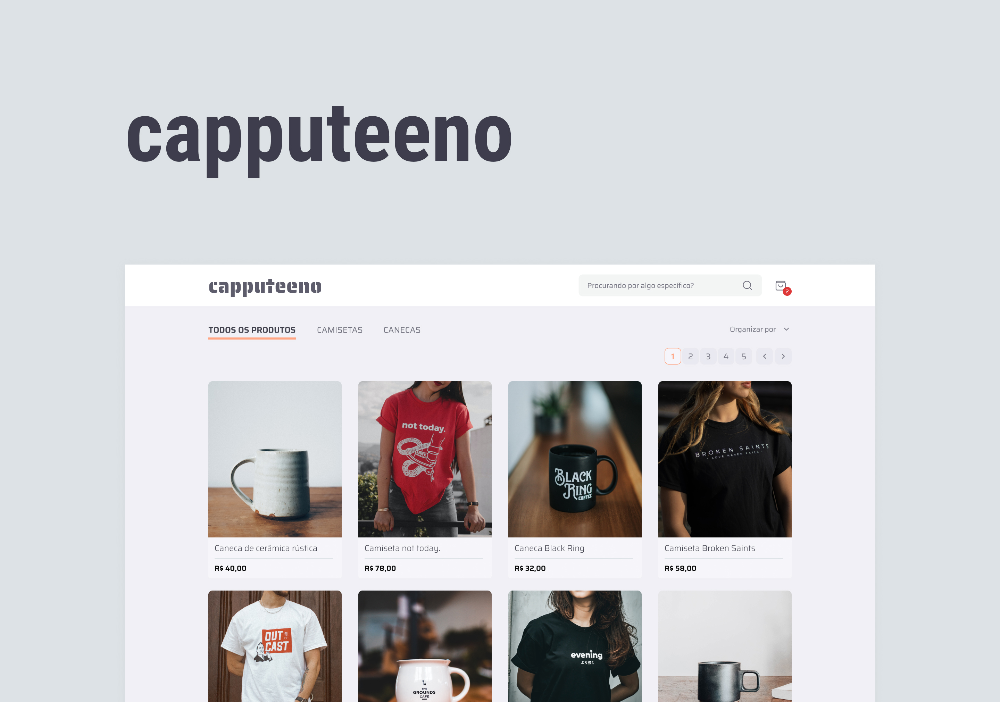

<h1 align="center">
    Desafio da Rocketseat
</h1>

<br />

<div align="center">
  
</div>

<h3 align="center">O desafio é implementar um e-commerce para venda de canecas e camisetas</h3>

Esse projeto foi desenvolvido com o objetivo de aprimorar minha compreensão de critérios técnicos e de avaliação, seguindo um template predefinido. Escolhi o desafio proposto pela Rocketseat, cujos critérios de avaliação e funcionalidades me atraíram, permitindo-me explorar algumas das funcionalidades do Next 13 e 14.

Considerando que o desafio é um pouco antigo, decidi atualizá-lo com algumas ferramentas que são utilizadas no mercado atual.

A API GraphQL especificada na documentação do desafio não está mais disponível. Portanto, optei por criar minha própria API usando as API Handlers, mantendo o GraphQL como a base da API.

<h2 id="features">Funcionalidades:</h2>

- [ ✓ ] Catálogo de produtos com paginação
- [ ✓ ] Filtragem produtos por categoria
- [ ✓ ] Busca por nome do produto
- [ ✓ ] Adicionar e remover produtos do carrinho
- [ ✓ ] Finalizar compra

<h2 id="techs">Tecnologias:</h2>

- [NextJS](https://nextjs.org/)
- [Typescript](https://www.typescriptlang.org/)
- [TailwindCSS](https://tailwindcss.com/)
- [GraphQL](https://graphql.org/)
- [Apollo Server](https://www.apollographql.com/docs/apollo-server/)
- [Apollo Client](https://www.apollographql.com/docs/react/)
- [Zustand](https://github.com/pmndrs/zustand)

<h2 id="run">Rodando o projeto:</h2>

Você precisa ter o [Node](https://nodejs.org/en/), o [Git](https://git-scm.com/) e algum gerenciador de pacotes([NPM](https://docs.npmjs.com/downloading-and-installing-node-js-and-npm/) || [Yarn](https://classic.yarnpkg.com/lang/en/docs/install)) instalados em sua máquina.

```bash
1. Clone o repositório:
$ git clone https://github.com/gabriellima2/challenge.git

2. Acesse a pasta e instale as dependências via terminal:
$ yarn || npm i

3. Inicie a aplicação em modo de desenvolvimento:
$ yarn dev || npm run dev

4. O servidor será aberto em http://localhost:3000
```
<p align="center">Projeto feito com 💙 por <a href="https://www.linkedin.com/in/gabriel-lima-860612236">Gabriel Lima</a></p>
